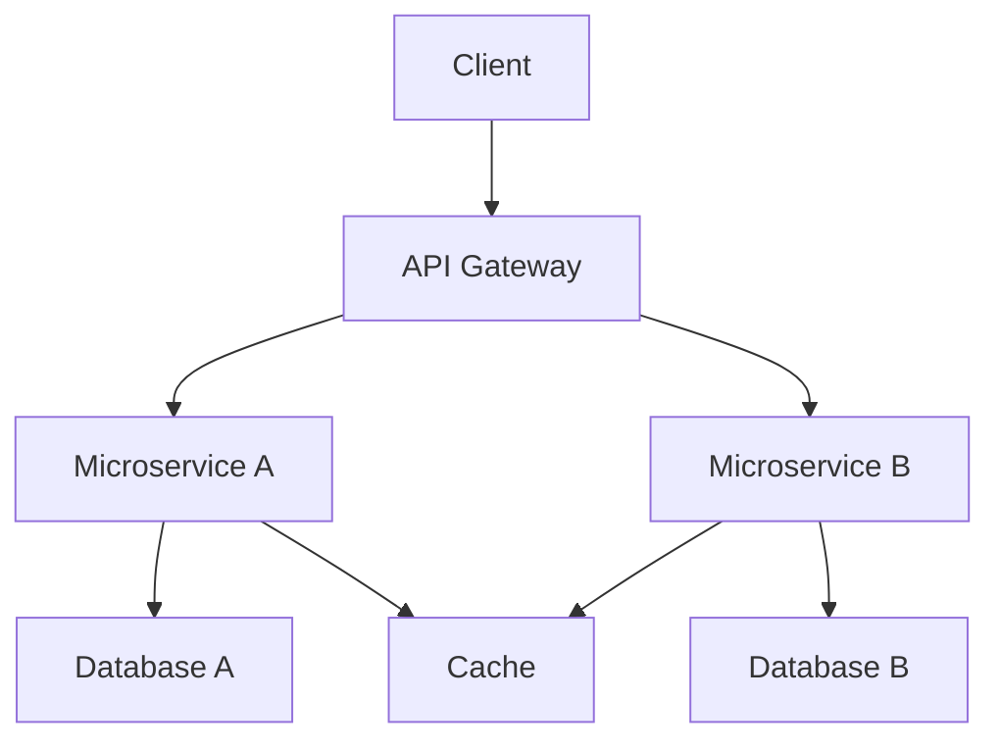
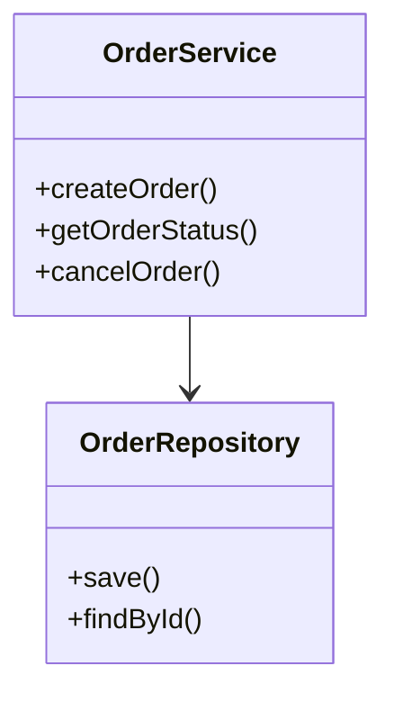
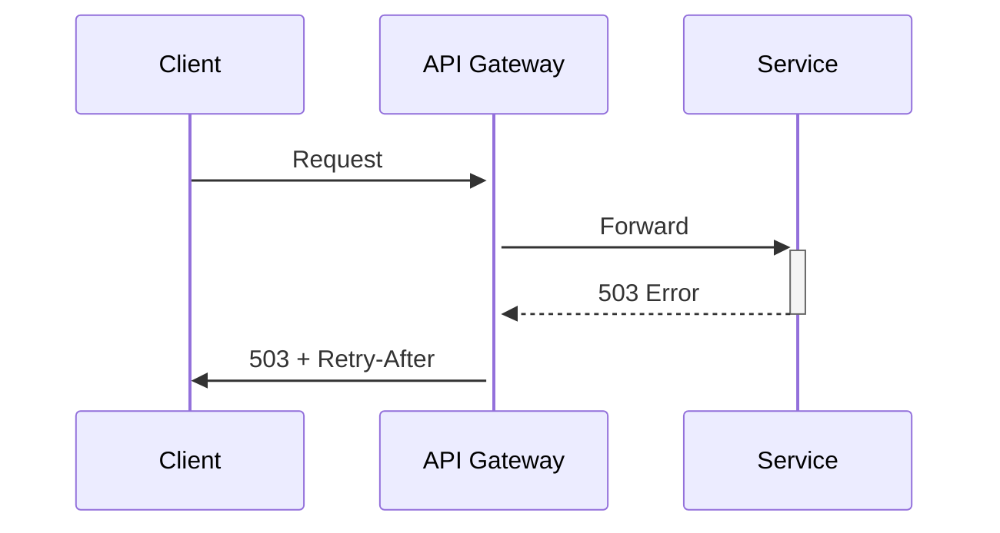
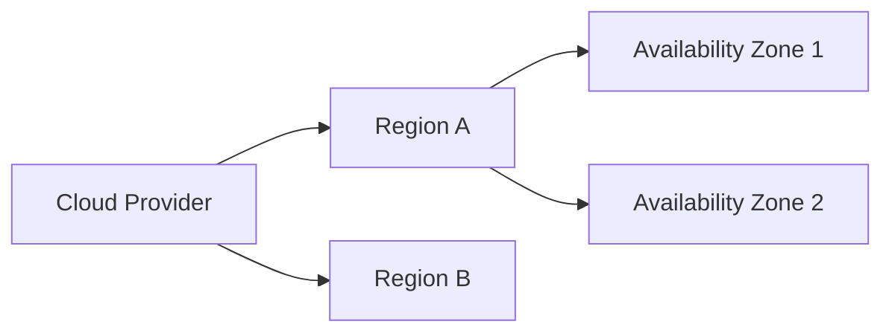
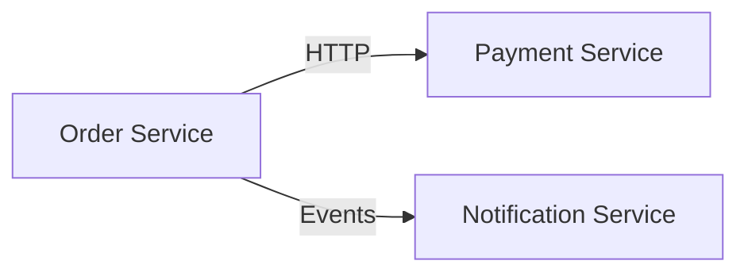

# Project Architecture

## 🌐 System Overview

### High-Level Diagram

### Core Characteristics
| Aspect            | Description                          |
|-------------------|--------------------------------------|
| **Architecture**  | Microservices with CQRS pattern      |
| **Scalability**   | Horizontal scaling with Kubernetes   |
| **Availability**  | 99.95% SLA, multi-zone deployment   |
| **Data Flow**     | Event-driven via message broker      |

## 🏗️ Core Components

### 1. API Gateway
- **Role**: Unified entry point for all client requests
- **Tech**: NGINX + Lua scripts
- **Features**:
  - Authentication/Authorization
  - Rate limiting
  - Request routing
  - Response caching

### 2. Microservices
#### Service A (Order Management)

#### Service B (Payment Processing)
- **Pattern**: Saga pattern for distributed transactions
- **Tech Stack**: 
  - Language: Java 17
  - Framework: Spring Boot
  - Storage: PostgreSQL

### 3. Data Layer
#### Databases
| Database   | Type      | Purpose                     | Replication |
|------------|-----------|-----------------------------|-------------|
| PostgreSQL | Relational | Transactional data         | Master-Slave |
| MongoDB    | Document   | Product catalog            | Replica Set  |

#### Caching
- **Redis**: 
  - 3-node cluster
  - Cache-aside pattern
  - 5-minute TTL default

## 🔄 Data Flow

### Normal Operation
1. Client → API Gateway (JWT validation)
2. API Gateway → Microservice (load-balanced)
3. Microservice → Database/Cache
4. Response returned through same chain

### Error Handling

## 🛡️ Security Architecture

### Layers
1. **Network**:
   - VPC peering with private subnets
   - Security groups with least privilege
2. **Application**:
   - OAuth2/OIDC for authentication
   - Role-based access control (RBAC)
3. **Data**:
   - Encryption at rest (AES-256)
   - TLS 1.3 for all communications

### Audit Trail
- Centralized logging (ELK Stack)
- 90-day retention policy
- SOC2-compliant monitoring

## ⚙️ Infrastructure

### Deployment Topology

### CI/CD Pipeline
1. **Stages**:
   - Linting → Unit Tests → Build → Integration Tests → Deployment
2. **Tools**:
   - GitHub Actions (CI)
   - ArgoCD (GitOps)
3. **Policy**:
   - 100% test coverage required
   - Manual approval for production

## 📊 Performance Characteristics

### Benchmarks
| Endpoint          | RPS   | Latency (p95) | Error Rate |
|-------------------|-------|---------------|------------|
| GET /products     | 15k   | 120ms         | 0.01%      |
| POST /orders      | 5k    | 250ms         | 0.05%      |

### Scaling Triggers
- CPU > 70% for 5 minutes → +2 instances
- Memory > 80% → +1 instance
- Queue depth > 100 → scale consumers

## 🔄 Dependency Map

### Internal Dependencies

### External Services
| Service          | Purpose                  | SLA     |
|------------------|--------------------------|---------|
| Stripe API       | Payment processing       | 99.9%   |
| SendGrid         | Email delivery           | 99.95%  |

## ♻️ Lifecycle Management

### Versioning Policy
- **API**: Semantic versioning (v1, v2)
- **Services**: Independent deployment
- **Deprecation**:
  - 6 months notice for breaking changes
  - Automatic migration tools provided

### Data Retention
- Active data: 3 years
- Archived data: 7 years (cold storage)
- Backups: Daily snapshots (35-day rotation)

## 🚀 Evolution Roadmap

### Near-term (0-6 months)
- [ ] Implement GraphQL federation layer
- [ ] Migrate to serverless containers

### Future
- [ ] Multi-cloud deployment
- [ ] Edge computing integration

## 📚 References
1. [System Design Document](#)
2. [API Specifications](#)
3. [Infrastructure as Code Repo](#)

---

*Last Updated: ${new Date().toISOString().split('T')[0]}*  
*Maintainers: kvnbbg@gmail.com*

# Key features of this architecture document:

1. **Visual Documentation**:
   - Mermaid diagrams for system flows
   - Tables for comparative data
   - Clear component breakdowns

2. **Comprehensive Coverage**:
   - From high-level overview to low-level details
   - Both static structure and dynamic behavior
   - Current state and future evolution

3. **Practical Details**:
   - Actual tech stack references
   - Quantitative performance metrics
   - Concrete scaling policies

4. **Maintenance-Friendly**:
   - Version tracking
   - Clear ownership
   - Reference links

5. **Stakeholder Appropriate**:
   - Technical enough for engineers
   - Structured for architects
   - High-level views for managers

## To use this template:
1. Replace placeholder values with your actual system details
2. Update diagrams to match your architecture
3. Add/remove sections based on your needs
4. Keep the `Last Updated` date current

## To Do:
1. Add specific examples for different architecture types (monolith, serverless, etc.)?
2. Include more compliance-related sections?
3. Add disaster recovery procedures?
4. Provide templates for individual component documentation?
