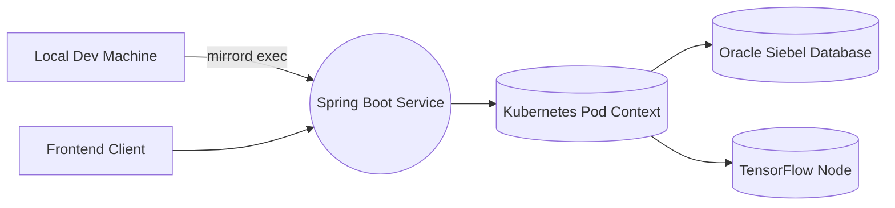
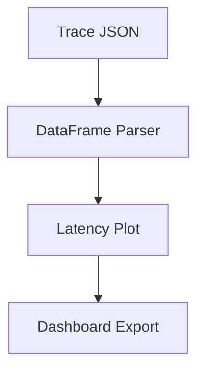

# 🪞 Mirrord Integration Guide

> **Connect local development to your live Kubernetes environment**  
> Project: [bookish-octo-invention](https://github.com/Kvnbbg/bookish-octo-invention)  
> Fork: [Kvnbbg/mirrord](https://github.com/Kvnbbg/mirrord)

---

## 🧭 Overview

**mirrord** lets you run your **local backend** as if it were inside the **real Kubernetes cluster**.  
It mirrors:
- Network traffic  
- Environment variables  
- File I/O  
- Pod identity  

This allows fast debugging and accurate testing — no redeploys needed.

---

## ⚙️ Architecture



* Local traffic behaves like cloud traffic.
* Pods stay untouched — perfect for dev and staging testing.

---

## 🚀 Quick Start

### 1. Clone the Repo

```bash
git clone https://github.com/Kvnbbg/bookish-octo-invention.git
cd bookish-octo-invention
```

### 2. Install Dependencies

```bash
sudo apt install openjdk-17-jdk maven nodejs npm
```

### 3. Install Mirrord

```bash
curl -fsSL https://raw.githubusercontent.com/metalbear-co/mirrord/main/install.sh | bash
```

### 4. Verify Cluster Access

```bash
kubectl get pods -n dev
```

---

## 🧩 Dev Workflow

| Step                | Command            | Description                          |
| ------------------- | ------------------ | ------------------------------------ |
| **Deploy test pod** | `make deploy-test` | Create the backend test pod          |
| **Mirror backend**  | `make mirror`      | Run your JAR mirrored to Kubernetes  |
| **Auto mode**       | `make auto`        | Auto-detect pod and mirror instantly |
| **Generate report** | `make report`      | Copy report template with timestamp  |
| **Analyze latency** | `make analyze`     | Open Jupyter notebook for metrics    |
| **Clean logs**      | `make clean-logs`  | Reset old reports                    |

---

## 🧠 Example Session

```bash
# Build project
mvn clean package

# Run mirrord session
mirrord exec --target pod/backend-api-dev-1234 -n dev -- \
  java -jar target/bookish-octo-invention.jar
```

✅ Your local backend now behaves as if it’s deployed in Kubernetes — real Oracle DB, real latency, no redeploys.

---

## 📊 Sample Report Snapshot

| Metric               | Value   |
| -------------------- | ------- |
| Avg Latency          | 45.7 ms |
| Max Latency          | 213 ms  |
| TensorFlow Inference | 92.3 ms |
| Oracle Query         | 132 ms  |
| Error Rate           | 0.4 %   |
| Memory Peak          | 850 MiB |

> *"Local realism achieved — no deployment friction."*

---

## 🔒 Security & Compliance

| Control             | Status | Notes                     |
| ------------------- | ------ | ------------------------- |
| Namespace Isolation | ✅      | Dev-only                  |
| RBAC Policy         | ✅      | See `mirrord-policy.yaml` |
| Secret Masking      | ✅      | Siebel credentials hidden |
| SSL Validation      | ✅      | Verified with `openssl`   |
| Production Access   | 🚫     | Disabled for safety       |

---

## 🧰 CI/CD Integration

```yaml
name: Mirrord Integration
on: [push, pull_request]
jobs:
  mirrord-test:
    runs-on: ubuntu-latest
    steps:
      - uses: actions/checkout@v4
      - name: Install mirrord
        run: curl -fsSL https://raw.githubusercontent.com/metalbear-co/mirrord/main/install.sh | bash
      - name: Mirror test
        run: mirrord exec --target pod/backend-api-dev-1234 -n dev -- \
              java -jar target/bookish-octo-invention.jar
```

---

## 🧮 Performance Analysis

* Run: `make analyze`
* Notebook: `ops/mirrord/mirrord-log-analysis.ipynb`
* Source: `trace-report.json`

### Visualization



---

## 🪶 Developer Notes

**Best Practices**

* Keep mirrord sessions short (under 1h).
* Always use the `dev` namespace.
* Store results in `/ops/mirrord/reports/`.
* Use Grafana for advanced latency visualization.
* Document findings in `mirrord-report.md`.

---

## 🧾 License & Credits

| Component              | License | Maintainer                                          |
| ---------------------- | ------- | --------------------------------------------------- |
| bookish-octo-invention | MIT     | [Kevin Marville](https://github.com/Kvnbbg)         |
| mirrord                | MIT     | [Kvnbbg/mirrord](https://github.com/Kvnbbg/mirrord) |

> *“Build locally, feel the cloud, deploy when it’s truly ready.”*  
> — Kevin Marville

---

## 🔗 Related Links

* [Main Repository](https://github.com/Kvnbbg/bookish-octo-invention)
* [Mirrord Fork](https://github.com/Kvnbbg/mirrord)
* [TensorFlow Integration Docs](https://www.tensorflow.org/)
* [Spring Boot Reference](https://docs.spring.io/spring-boot/docs/current/reference/htmlsingle/)
* [Kubernetes RBAC](https://kubernetes.io/docs/reference/access-authn-authz/rbac/)

---

## 🧭 Navigation

* [⬅️ Back to Project Overview](../README.md)
* [🧩 Mirrord Folder on GitHub](https://github.com/Kvnbbg/bookish-octo-invention/tree/main/ops/mirrord)
* [📊 Reports Folder](https://github.com/Kvnbbg/bookish-octo-invention/tree/main/ops/mirrord/reports)
