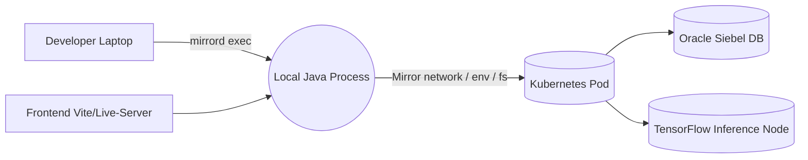

# 🪞 mirrord Integration — bookish-octo-invention

> Connect your **local backend** to the **cloud environment** — test, debug, and optimize code as if it were already deployed.

---

## 📘 Overview

This guide documents the integration of [**mirrord**](https://github.com/Kvnbbg/mirrord) with the main project  
[`bookish-octo-invention`](https://github.com/Kvnbbg/bookish-octo-invention).

mirrord lets you run your local application in *real Kubernetes conditions* —  
network, environment variables, and file I/O are all mirrored from a live pod.

It’s ideal for testing:
- Spring Boot microservices connected to Oracle Siebel 21c
- WebSocket backends and gamification logic
- TensorFlow inference layers under real-world latency
- REST endpoints and internal APIs (JWT + HTTPS)

---

## ⚙️ Architecture



* **Local process** behaves as if running inside the target pod.
* **Inbound/outbound traffic** and **environment variables** are mirrored securely.
* **No redeploys** are required — instant feedback loop.

---

## 🧩 Prerequisites

| Component     | Version | Purpose                 |
| ------------- | ------- | ----------------------- |
| Ubuntu / WSL2 | 24.04+  | Local development       |
| Java          | 17+     | Backend service         |
| Spring Boot   | 3.1+    | REST + WebSocket API    |
| TensorFlow    | 2.12+   | ML inference layer      |
| Oracle Siebel | 21c+    | CRM & recipe sync       |
| Kubernetes    | 1.28+   | Cloud environment       |
| Docker        | 24+     | Local container runtime |
| Maven         | 3.9+    | Build system            |

---

## 🚀 Installation

### 1. Install mirrord CLI

```bash
curl -fsSL https://raw.githubusercontent.com/metalbear-co/mirrord/main/install.sh | bash
```

### 2. Verify cluster connectivity

```bash
kubectl get pods -n dev
```

### 3. Run your backend locally with live pod mirroring

```bash
mvn clean package
mirrord exec --target pod/backend-api-dev-1234 -n dev -- \
  java -jar target/bookish-octo-invention.jar
```

🧠 *This launches your local process with traffic, env, and file streams mirrored from the target pod.*

---

## 🔁 Workflow Summary

| Stage                     | Command                                                      | Result                 |
| ------------------------- | ------------------------------------------------------------ | ---------------------- |
| **Build backend**         | `mvn clean package`                                          | Generates the JAR      |
| **Start local mirror**    | `mirrord exec ...`                                           | Mirrors pod context    |
| **Observe logs**          | `kubectl logs -f pod/backend-api-dev-1234`                   | View live traffic      |
| **Test TensorFlow layer** | `mirrord exec ... python3 src/main/python/inference_test.py` | Simulated ML inference |
| **Sync changes**          | `git add . && git commit -m "mirrord integration"`           | Push to CI/CD          |

---

## 🧠 Testing Mirrord with TensorFlow Module

```bash
mirrord exec --target pod/tf-model-dev -n dev -- \
  python3 src/main/python/inference_test.py --env TF_MIRROR_TEST=1
```

➡ Logs saved in `logs/mirrord_tf_latency.log` for latency benchmarking under cloud conditions.

---

## 🔒 Security & RBAC Policy

Create `/ops/mirrord/mirrord-policy.yaml`:

```yaml
apiVersion: rbac.authorization.k8s.io/v1
kind: Role
metadata:
  namespace: dev
  name: mirrord-role
rules:
  - apiGroups: [""]
    resources: ["pods", "pods/exec", "secrets"]
    verbs: ["get", "list", "watch"]
---
apiVersion: rbac.authorization.k8s.io/v1
kind: RoleBinding
metadata:
  name: mirrord-rolebinding
  namespace: dev
subjects:
  - kind: User
    name: developer
    apiGroup: rbac.authorization.k8s.io
roleRef:
  kind: Role
  name: mirrord-role
  apiGroup: rbac.authorization.k8s.io
```

✅ Only use mirrord in **non-production namespaces**.
✅ Mask sensitive Siebel credentials and `.env` variables.
✅ Prefer read-only modes for DB testing.

---

## 📊 Observability

To trace mirrored network activity:

```bash
mirrord exec --tcp --debug --target pod/backend-api-dev-1234 -n dev -- \
  java -jar target/bookish-octo-invention.jar
```

Logs and trace output can be redirected to Grafana via Promtail or stored in `/ops/monitoring/trace-report.json`.

---

## 🧮 Comparison with Alternatives

| Tool               | Focus              | Pros                        | Cons                             |
| ------------------ | ------------------ | --------------------------- | -------------------------------- |
| **mirrord**        | Real pod mirroring | Fast, minimal, secure       | Linux only, permissions required |
| **Telepresence 2** | Local proxy        | Broad adoption, IDE plugins | Heavier, slower                  |
| **Okteto**         | Full dev env sync  | Cloud-native workflow       | Requires Okteto Cloud            |
| **Tilt.dev**       | CI/CD preview      | Instant reloads             | No traffic mirroring             |

**Verdict:**
mirrord is the most lightweight and direct fit for *local-to-pod* workflows in `bookish-octo-invention`.

---

## 🧰 CI/CD Integration

Create `.github/workflows/mirrord-test.yml`:

```yaml
name: mirrord Integration Test
on: [push, pull_request]

jobs:
  test-mirrord:
    runs-on: ubuntu-latest
    steps:
      - uses: actions/checkout@v4
      - name: Install mirrord
        run: curl -fsSL https://raw.githubusercontent.com/metalbear-co/mirrord/main/install.sh | bash
      - name: Run Backend Mirror Test
        run: mirrord exec --target pod/backend-api-dev-1234 -n dev -- \
              java -jar target/bookish-octo-invention.jar
```

---

## 🧠 Troubleshooting

| Issue                  | Cause                 | Fix                                    |
| ---------------------- | --------------------- | -------------------------------------- |
| `permission denied`    | Missing Linux caps    | Run with `sudo` or adjust capabilities |
| `connection timeout`   | Cluster not reachable | Check kubeconfig and namespace         |
| `env vars missing`     | Not mirrored properly | Add `--env` flag manually              |
| `SSL handshake failed` | Self-signed certs     | Verify `openssl verify cert.pem`       |

---

## 🧠 Advanced Tips

* Use `mirrord config new` to generate custom profiles.
* Combine with `tmux` to monitor local and pod logs side by side.
* For ML experiments, run mirrored inferences with GPU enabled:

  ```bash
  mirrord exec --env TF_MIRROR_TEST=1 --target pod/tf-node-dev \
    python3 src/main/python/inference.py --gpu
  ```

---

## 🧾 License

* **bookish-octo-invention** — © Kevin Marville (MIT)
* **mirrord** — © Metalbear (MIT)

Both repositories are open-source and compatible for enterprise use.

---

## 💡 Credits

Maintained by [@Kvnbbg](https://github.com/Kvnbbg)
Project repositories:

* [bookish-octo-invention](https://github.com/Kvnbbg/bookish-octo-invention)
* [mirrord fork](https://github.com/Kvnbbg/mirrord)

---

> *"Code locally. Think globally. Mirror reality."*
