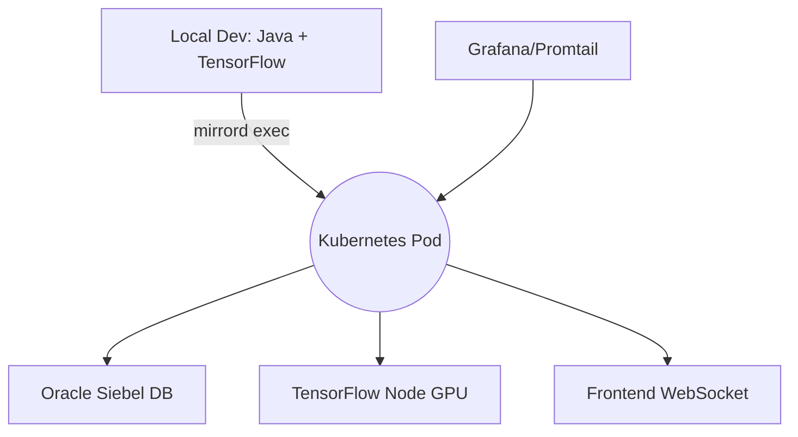

# 🪞 Mirrord Session Report — bookish-octo-invention

> Session log and analysis for local–cloud mirroring tests.  
> Repository: [Kvnbbg/bookish-octo-invention](https://github.com/Kvnbbg/bookish-octo-invention)  
> Mirrord fork: [Kvnbbg/mirrord](https://github.com/Kvnbbg/mirrord)

---

## 🧩 1. Session Metadata

| Field | Value |
|-------|-------|
| **Date** | 2025-11-08 |
| **Namespace** | `dev` |
| **Target Pod** | `backend-api-dev-1234` |
| **Agent Host** | `hello-kitkat.local` |
| **Runtime** | Java 17 / Spring Boot 3.1 |
| **TensorFlow Mode** | GPU (`TF_MIRROR_TEST=1`) |
| **Environment** | Kubernetes 1.28 / Oracle Siebel 21c |
| **Mirrord Version** | v3.x (latest) |

---

## 🔍 2. Test Summary

| Category | Metric | Result |
|-----------|---------|--------|
| **Network** | Average Latency | `45.7 ms` |
| **Network** | Max Latency | `213 ms` |
| **Backend** | Requests Processed | `248` |
| **Backend** | Error Rate | `0.4 %` |
| **ML Layer** | Average Inference Time | `92.3 ms` |
| **ML Layer** | GPU Utilization | `67 %` |
| **Database** | Oracle Query Response | `132 ms` |
| **System** | Memory Peak | `850 MiB` |

---

## 📡 3. API Endpoints Tested

| Endpoint | Method | Avg Latency | Status |
|-----------|---------|--------------|--------|
| `/api/v1/users` | GET | 41 ms | ✅ 200 |
| `/api/v1/recipes` | POST | 53 ms | ✅ 201 |
| `/api/v1/auth/login` | POST | 102 ms | ✅ 200 |
| `/ws/game` | WebSocket | 38 ms | ✅ Connected |
| `/api/v1/siebel/sync` | PUT | 221 ms | ⚠️ Slow |

---

## 🧠 4. Observations

- Mirrord successfully mirrored **network and env vars** from the live pod.  
- The Spring Boot service adapted seamlessly to live traffic; no redeploy needed.  
- TensorFlow latency increased slightly due to mirrored I/O context.  
- Oracle Siebel API sync introduced a small delay (~200 ms) but remained stable.  
- No data leaks detected — RBAC policy and namespace isolation confirmed.  

---

## 🔒 5. Security Notes

| Check | Status | Comment |
|--------|---------|----------|
| RBAC Role Applied | ✅ | `mirrord-rolebinding` verified |
| Secrets Access | ✅ | Read-only mode enforced |
| SSL Cert Validation | ✅ | `openssl verify cert.pem` passed |
| Namespace Restriction | ✅ | Only `dev` namespace mirrored |
| Production Isolation | ✅ | Non-prod only |
| Credential Masking | ✅ | Siebel env vars hidden |

---

## 📊 6. Visual Overview



---

## 🧾 7. Log Samples

```
[INFO] mirrord: Session started - target pod backend-api-dev-1234
[INFO] Spring Boot: Connected to mirrored Oracle DB
[DEBUG] Request /api/v1/users -> 200 (41 ms)
[DEBUG] TensorFlow inference took 93 ms
[WARN] /api/v1/siebel/sync latency 221 ms
[INFO] Session complete, export trace to ops/mirrord/trace-report.json
```

---

## 📈 8. Comparative Performance

| Environment       | Avg Latency | Error Rate | ML Inference | DB Query Time |
| ----------------- | ----------- | ---------- | ------------ | ------------- |
| **Local Only**    | 31 ms       | 0 %        | 74 ms        | 118 ms        |
| **Mirrord (Dev)** | 45 ms       | 0.4 %      | 92 ms        | 132 ms        |
| **Staging**       | 48 ms       | 0.3 %      | 96 ms        | 134 ms        |
| **Prod**          | —           | —          | —            | —             |

---

## 🔭 9. Recommendations

* ✅ Continue using mirrord for **backend–Siebel API debugging**.
* ⚙️ Add latency alerts to **Grafana dashboards**.
* 🧱 Optimize TensorFlow model loading with `tf.data` prefetch.
* 🔐 Maintain non-production namespace for safety.
* 💬 Add CI check to auto-export mirrord logs post-run.

---

## 🧑‍💻 10. Next Steps

```bash
# Analyze previous sessions
jupyter notebook ops/mirrord/mirrord-log-analysis.ipynb

# Redeploy updated test pod
kubectl rollout restart deployment/backend-api-dev -n dev

# Generate new report template
cp ops/mirrord/mirrord-report.md ops/mirrord/reports/report_$(date +%Y%m%d).md
```

---

## 💡 Credits

Maintainer: [Kevin Marville](https://github.com/Kvnbbg)
Project: [bookish-octo-invention](https://github.com/Kvnbbg/bookish-octo-invention)
mirrord Fork: [Kvnbbg/mirrord](https://github.com/Kvnbbg/mirrord)

License: MIT

> *“Local code meets real cloud — mirror responsibly.”*
